# KSU SWE 3643 Software Testing and Quality Assurance Semester Project: Web-Based Calculator
This repository consists of a calculator web application for a Quality Assurance and Testing class.
As such, there is a src folder which contains the webserver, logic module, and both unit and end-to-end tests.
Documentation is within the top-level folder as well, but this README should provide all the necessary instructions to run the program.

## Table of Contents

- [Team Members](#team-members)
- [Architecture](#architecture)
- [Environment](#environment)
- [Executing the Web Application](#executing-the-web-application)
- [Executing Unit Tests](#executing-unit-tests)
- [Reviewing Unit Test Coverage](#reviewing-unit-test-coverage)
- [Executing End-To-End Tests](#executing-end-to-end-tests)
- [Final Video Presentation](#final-video-presentation)

### Team Members
Josh Early and Ian McCracken

### Architecture
There are two modules; the web server and the calculator logic.
The logic is all self-contained, and is only accessed by the controller, Flask.
Flask serves the webpages through multiple views.
First, it directs the user to the home page, then upon clicking one of the functions, it directs to another route which handles displaying the result.

Additionally, the tests are kept separated from the rest of the program.
The unit tests only interface with the logic module, and don't touch the UI at all.
The End-to-End tests go directly through the webpage's html tags to perform its tests.
In this way, they don't touch the logic module without being parsed through the controller first.


### Environment
This is a cross-platform application and should work in Windows 10+, Mac OSx Ventura+, and Linux environments.
Note that the application has only been carefully tested in Windows 10.

### Executing the Web Application
First, clone this repository by running `git clone https://github.com/PapiJoker/QA-Project.git` in the folder where you want the project located.
Then, install the dependencies by running `pip install -r requirements.txt`.
If you're missing `pip`, try `python -m pip install -r requirements.txt`.
Visit [here](https://packaging.python.org/en/latest/tutorials/installing-packages/) if you're still having trouble.
Finally, run the app with `python run.py`.
ADD PHOTOS FOR RUNNING TURN INTO STEPS
### Executing Unit Tests
With the webserver running, you can continue with testing.
Open another terminal in order to keep the webserver running.
Execute the unit tests with `python -m pytest ./src/tests/` from your top-level folder.

```bash
> pytest .\src\tests\
================================================= test session starts =================================================
platform win32 -- Python 3.12.2, pytest-8.3.3, pluggy-1.5.0
rootdir: C:\Users\Josh\Documents\GitHub\QA-Project
plugins: base-url-2.1.0, playwright-0.5.2
collected 39 items

src\tests\test_cases.py .......................................                                                  [100%]

================================================= 39 passed in 0.10s ==================================================
```

### Reviewing Unit Test Coverage
100% coverage is achieved with the Unit Tests for 'calculator_logic'


### Executing End-To-End Tests
End-To-End tests are run similarly to the unit tests.
Open another terminal and run `python -m playwright install-deps`.
Then, with the webserver running, run `python -m pytest ./src/e2e/`.

```bash
> pytest .\src\e2e\
================================================= test session starts =================================================
platform win32 -- Python 3.12.2, pytest-8.3.3, pluggy-1.5.0
rootdir: C:\Users\Josh\Documents\GitHub\QA-Project
plugins: base-url-2.1.0, playwright-0.5.2
collected 8 items

src\e2e\test_cases.py ........                                                                                   [100%]

================================================== 8 passed in 7.90s ==================================================
```

### Final Video Presentation
// Link to our final video presentation