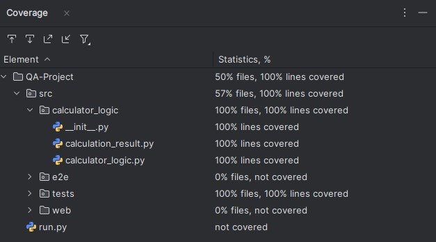

# KSU SWE 3643 Software Testing and Quality Assurance Semester Project: Web-Based Calculator
Short 2-3 sentence description of what the repository contains
## Table of Contents

- [Team Members](#team-members)
- [Architecture](#architecture)
- [Environment](#environment)
- [Executing the Web Application](#executing-the-web-application)
- [Executing Unit Tests](#executing-unit-tests)
- [Reviewing Unit Test Coverage](#reviewing-unit-test-coverage)
- [Executing End-To-End Tests](#executing-end-to-end-tests)
- [Final Video Presentation](#final-video-presentation)

### Team Members
Josh Early and Ian McCracken

### Architecture

### Environment
This is a cross-platform application and should work in Windows 10+, Mac OSx Ventura+, and Linux environments. Note that the application has only been carefully tested in Windows 10.

To prepare your environment to execute this application:
 1. [Install the latest Java runtime for your system.](https://www.java.com/en/download/manual.jsp)
 2. ...

To configure Playwright for end-to-end testing:
  1. ...

## Executing the Web Application
Describe the detailed steps to build and execute your web application *from the command line (terminal / console)*. Your user may not have an IDE installed. 

## Executing Unit Tests
Describe the detailed steps to build and execute all of your unit tests *from the command line (terminal / console)*. Your user may not have an IDE installed.
```bash
> pytest .\src\tests\
================================================= test session starts =================================================
platform win32 -- Python 3.12.2, pytest-8.3.3, pluggy-1.5.0
rootdir: C:\Users\Josh\Documents\GitHub\QA-Project
plugins: base-url-2.1.0, playwright-0.5.2
collected 39 items

src\tests\test_cases.py .......................................                                                  [100%]

================================================= 39 passed in 0.10s ==================================================
```

## Reviewing Unit Test Coverage
100% coverage is achieved with the Unit Tests for 'calculator_logic'
<p align = "center">
 
</p>

## Executing End-To-End Tests
Describe the detailed steps to build and execute all of your end-to-end unit tests *from the command line (terminal / console)*.
```bash
> pytest .\src\e2e\
================================================= test session starts =================================================
platform win32 -- Python 3.12.2, pytest-8.3.3, pluggy-1.5.0
rootdir: C:\Users\Josh\Documents\GitHub\QA-Project
plugins: base-url-2.1.0, playwright-0.5.2
collected 8 items

src\e2e\test_cases.py ........                                                                                   [100%]

================================================== 8 passed in 7.90s ==================================================
```

## Final Video Presentation
**[Please view our project's final presentation here on YouTube](https://www.youtube.com/watch?v=dQw4w9WgXcQ)

### Installation
First, clone this repository by running `git clone https://github.com/PapiJoker/QA-Project.git` in the folder where you want the project located.
Then, install the dependencies by running `pip install -r requirements.txt`.
If you're missing `pip`, try `python -m pip install -r requirements.txt`.
Visit [here](https://packaging.python.org/en/latest/tutorials/installing-packages/) if you're still having trouble.
Finally, run the app with `python run.py`.
Describe the detailed steps to build and execute all of your end-to-end unit tests
### Running Tests
Have one terminal open which is running the server locally on your machine (follow the above commands).
Then, open another terminal and run `python -m pytest`.
This command will run all the tests found by pytest; both end-to-end and unit tests.
If this does not work, run `python -m playwright install-deps`
